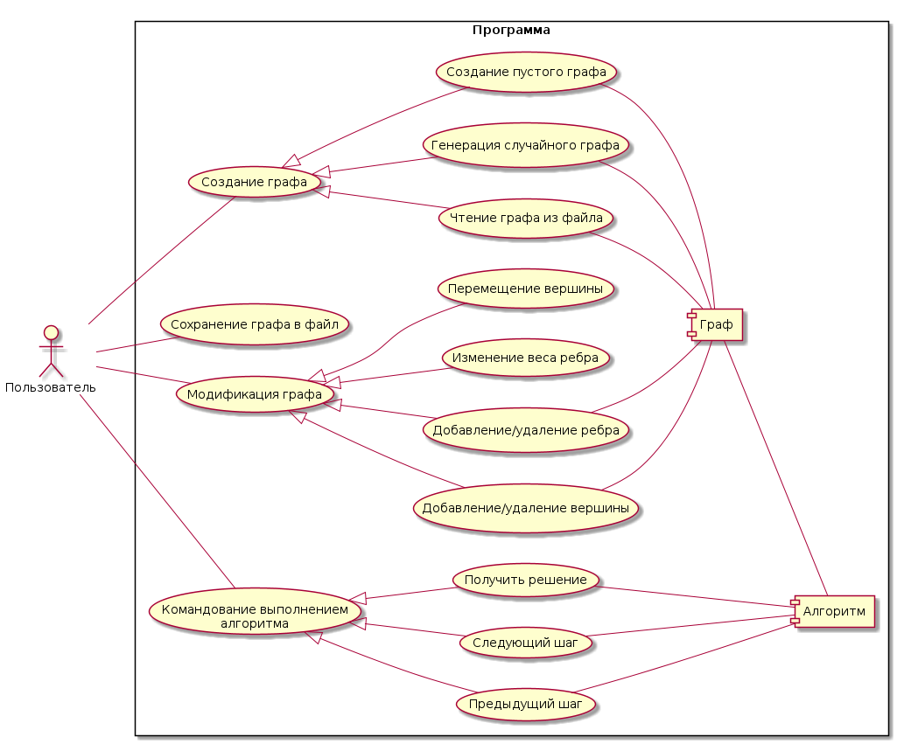
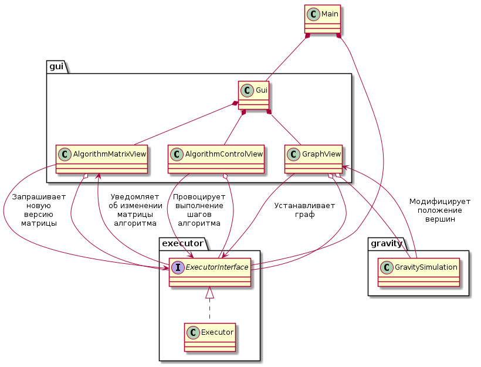

# Floyd-Warshall visualizer

## Спецификация
  *Задача*: визуализировать процесс работы алгоритма Флойда-Уоршелла.

  **Диаграмма последовательности проекта:**

  

  **Предварительная версия пользовательского интерфейса:**

  

  **Диаграмма прецедентов**

  

  **Диаграмма классов**

  

  **Диаграмма состояний**

  

## Распрделение ролей:
  1. [Рыжиков Александр](https://github.com/AlexRyzhickov) (8304) - пользовательский интерфейс (ввод и отрисовка графа).
  2. [Мешков Максим](https://github.com/Heliconter) (8304) - пользовательский интерфейс (визуализация работы алгоритма).
  3. [Колногоров Даниил](https://github.com/pajecawav) (8382) - реализация алгоритма, тестирование.

## План разработки:
- [x] Составление спецификации
- [x] Распределение ролей
- [x] Разработка прототипа пользовательского интерфейса
- [x] Возможность построения графа в пользовательском интерфейсе
- [x] Генерация случайного графа
- [x] Просмотр начального и конечного состояний алгоритма
- [x] Чтение/сохранение графа в файл
- [x] Возможность пошагового исполнения алгоритма
- [x] Возможность возврата алгоритма к предыдущим состояниям
- [x] Тестирование корректности работы алгоритма
- [ ] Дополнительный функционал
  - [x] Симуляция гравитации для вершин графа
  - [ ] Реализация Drag-and-Drop
